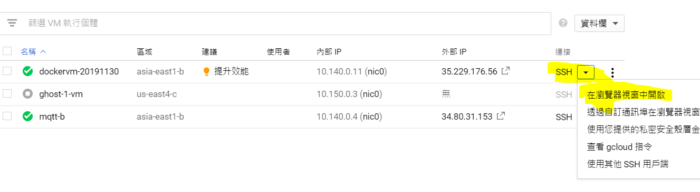
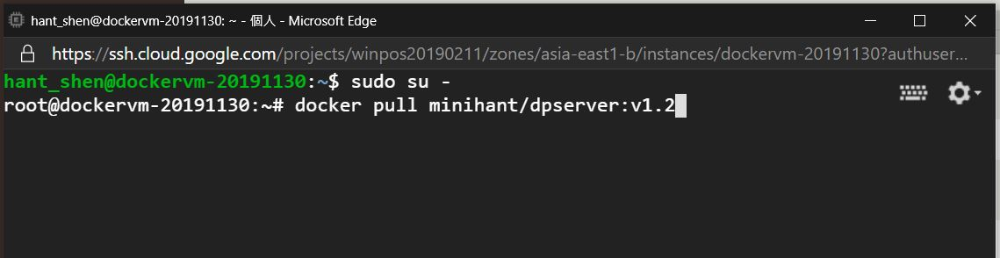
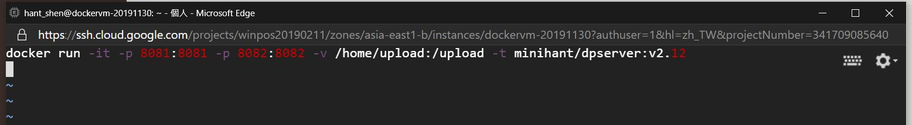

# Build Docker Image & Run
1. 修改版本號:
    * open "docker-compose.yaml"
    > 修改 image 版本號
    >> image: minihant/dpserver:v2.12
```yaml
{{#include ./resource/docker-compose.yaml}}
```

2. 在 Command Line 執行 :
    ```docker
    docker-compose build
    ```
3. push image 進 Docker Hub
    ```
    docker push minihant/dpserver:v2.12
    ```

4. pull image from GCP server
    * SSH 進入ＧＣＰserver

    

    * 進入 GCP terminal 
        ```linux
        sudo su -
        docker pull minihant/dpserver:v2.12
        ```
        

    
    * 修改　/home/hant_shen/run.sh 內 image的版本號
        

    * 執行 run.sh
    
